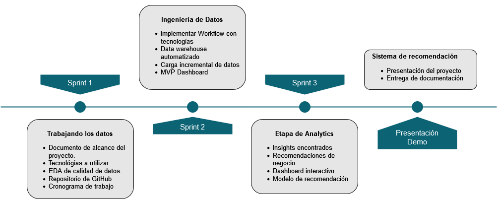
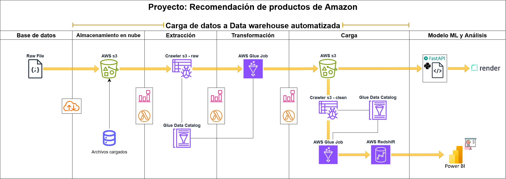
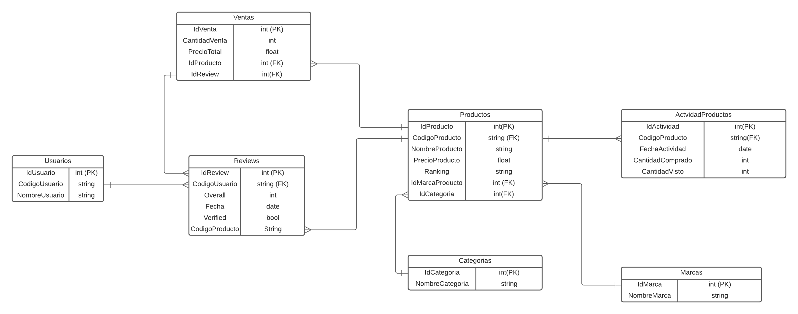

# InnoTech Solutions

"InnoTech Solutions" es una empresa ficticia dedicada a brindar soluciones tecnológicas innovadoras, enfocada en aplicar tecnología avanzada para resolver problemas y proporcionar soluciones efectivas a sus clientes

## Proyecto: Sistema de recomendación de productos

### 📋 Indice
1. [Descripcion del proyecto](#descripcion)
2. [Contenido del Repositorio](#con)
3. [Datasets](#data)
4. [Entendimiento de la Situación Actual](#ent)
5. [Objetivos del Proyecto](#obj)
6. [Flujo de Trabajo del Proyecto](#flujo)
7. [Trabajo en la Nube](#nube)
8. [Arquitectura Data Warehouse](#der)
9. [Tecnologías Utilizadas](#stack)
9. [Autores](#autores)

### 1. Descripcion del proyecto 
El objetivo principal de este proyecto es desarrollar un sistema de recomendación de productos para mejorar las ventas de la empresa Amazon. Se utilizarán algoritmos avanzados de aprendizaje automático para analizar el historial de compras, preferencias y comportamiento de navegación de los clientes.

### 2. Contenido del Repositorio 

El repositorio cuenta con:

+ `/documentacion`: Información detallada del trabajo realizado semana a semana
+ `/eda`: Notebooks donde se realizó el EDA y análisis previo al modelado de Machine Learning
+ `/src`: Contiene archivos adicionales como imágenes utilizadas 
+ `/README.md`: explicación y desarrollo del proyecto

### 3. Datasets 
Los datos se encuentran en el siguiente [link](https://drive.google.com/drive/folders/1KT0-qPYJmlr6w2o41sjJlPXCZ3SkHbN0?usp=drive_link).

### 4. Entendimiento de la Situación Actual 
Amazon ofrece una amplia gama de productos, lo que puede hacer que sea un desafío para los usuarios encontrar lo que están buscando. Además, muchos usuarios no están al tanto de la totalidad de la oferta de productos en la plataforma.

Dada su prominencia como uno de los gigantes del comercio electrónico a nivel global, Amazon está explorando nuevas estrategias para impulsar sus ventas y mantener su liderazgo en el mercado estadounidense. Para lograr este objetivo, han optado por colaborar con InnoTech Solutions, nuestra empresa reconocida por su capacidad para concebir soluciones innovadoras y generar resultados revolucionarios. Esta asociación busca abordar de manera proactiva los desafíos que Amazon enfrenta en la actualidad, centrándose en optimizar la experiencia del usuario y potenciar las ventas a través de soluciones tecnológicas avanzadas y estratégicas.

### 5. Objetivos del Proyecto 
- Analizar y procesar reseñas de clientes para extraer información relevante utilizando técnicas de Procesamiento de Lenguaje Natural (NLP).
- Crear un sistema de recomendación de compras futuras basado en análisis de reseñas, información de productos frecuentemente comprados juntos y puntuaciones de productos.
- Diseñar una arquitectura de datos escalable para el proyecto, permitiendo la ingesta eficiente de nuevos datos a la base de datos.
- Desarrollar un dashboard para los ejecutivos de la empresa que muestre datos relevantes para la toma de decisiones estratégicas.
- Implementar un conjunto de data pipelines para el procesamiento y almacenamiento eficiente de grandes cantidades de datos.

### 6. Flujo de Trabajo del Proyecto 

### 7. Trabajo en la Nube 

### 8. Arquitectura Data Warehouse

### 9. Tecnologías Utilizadas 
- GitHub, Git
- Google Docs, Sheets, Slides
- Python, Scikit-Learn, Pandas, PySpark, Numpy, SpaCy, Matplotlib
- Visual Studio Code
- AWS s3, Glue, Glue Data Catalog, Redshift, SageMaker, QuickSight, Cloudwatch

### 10. Autores
- Fabian Gonzalez, Ingeniero de Datos - [@FabianGonzalezz](https://github.com/FabianGonzalezz)
- Federico Molina, Científico de Datos - [@Federicomolina86](https://github.com/Federicomolina86)
- Francisco García, Analista de Datos- [@fransindi](https://github.com/fransindi)
- Ronnie Fuertes, Ingeniero de Datos- [@ronniefuertes](https://github.com/ronniefuertes)
